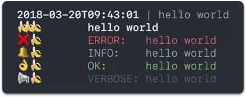

# lognana

> 🍌 An emoji fueled log system with zero dependencies


## Install

```console
$ npm install lognana
```


## Usage

```js
const Log = require( 'lognana' );

Log.emoji = '🍌';

// Check if the user is in verbose mode
if( process.argv.includes( '-v' ) || process.argv.includes( '--verbose' ) ) {
  Log.verboseMode = true;
};


Log.message( 'hello world' );
Log.welcome( 'hello world' );
Log.error( 'hello world' );
Log.info( 'hello world' );
Log.ok( 'hello world' );
Log.verbose( 'hello world' );
```

<p align="center">
	
</p>


## Release History

* v1.0.0 - First release
